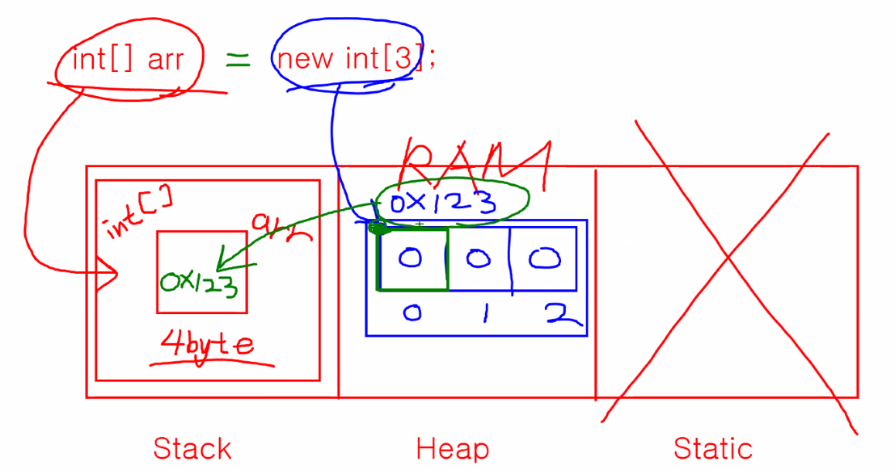
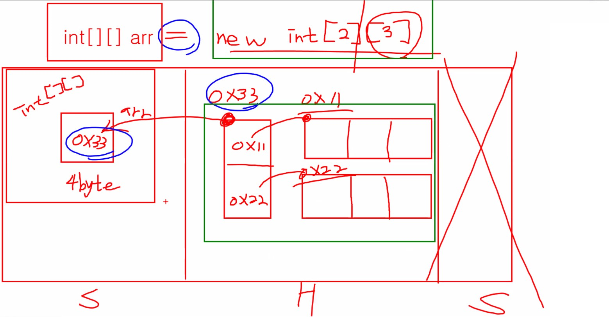
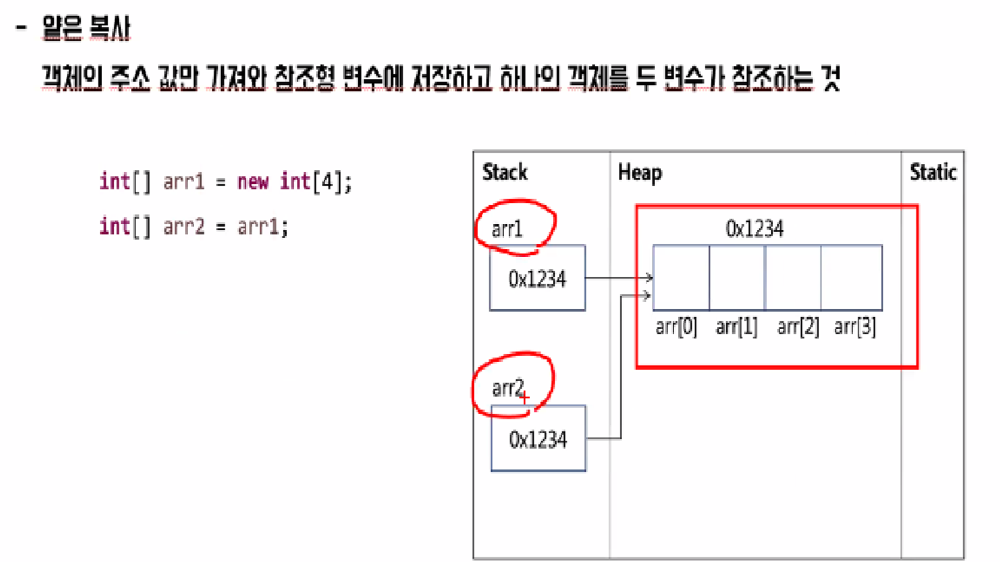
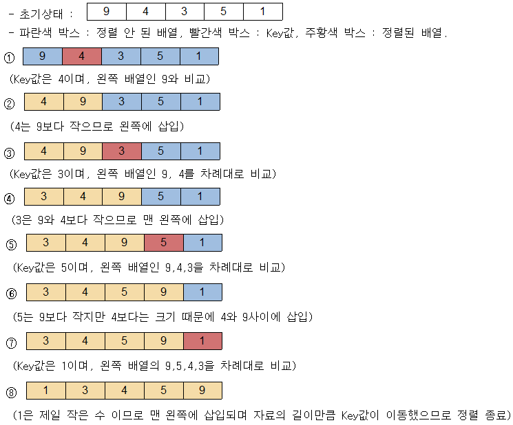
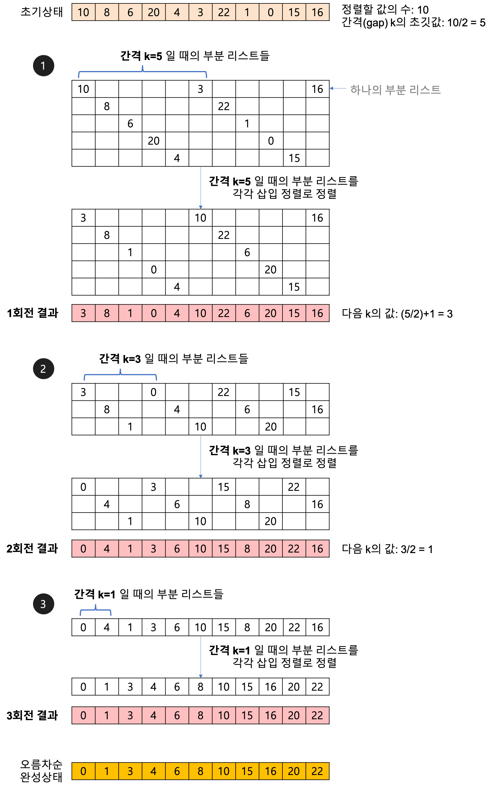
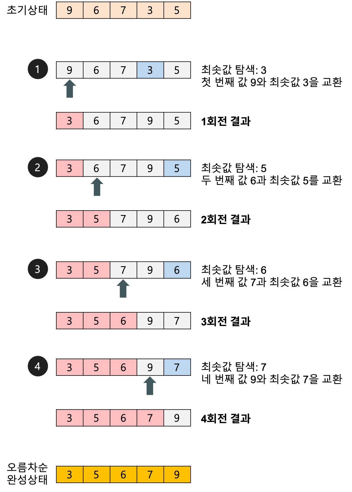

# 배열

## 배열의 정의

>💡 Java의 배열은 최초의 선언 이후 공간을 늘리거나 줄일 수 없다.
배열명은 배열의 내용이 아닌, 배열이 있는 위치를 가르키는 변수라고 생각하자.
    
- 배열이란 동일한 자료형의 변수들을 하나의 묶음으로 다루는 것
- 배열은 저장된 값 마다 0에서 시작하는 인덱스 번호가 부여된다.
  - 배열은 heap 영역에 new 연산자를 이용하여 크기를 할당한다. (박스 생성)
    
  - int[] arr 은 Stack 영역에 4byte(모든 참조형 자료형의 크기는 4byte) 크기의 박스를 만든다.
  - new int[3] 은 Heap 영역에 배열의 크기(length)만큼의 박스를 생성한다. 
    - 박스의 길이 만큼의 칸마다 0에서 시작하는 변수 값을 지정한다. 
    - (지정하지 않으면 각 자료형에 맞는 기본값을 지정한다.) 
    - 변수는 변할 수 있는 값이기에, 배열의 내용이 변경되어도 배열은 사용이 가능하다.
  - Heap 영역에 저장된 박스가 있는 위치(ox123~,주소는 매번 다르다)를 지정한다. 
    - 이는 배열의 첫번째 칸의 위치이며, 나머지 칸의 주소는 JVM이 할당한다. 
    - (사용자가 지정할 수 없다. Java는 포인터를 사용하지 않는다.)
  - 이후 대입 연산자를 통해, int[] arr 에 new int[0,1,2]의 주소를 가리킨다. (포인터)
        
>💡 배열의 주소를 표현할 때 I@4351bd48 와 같은 형식으로 출력되는데,  
이는 int 자료형인4351bd48 주소값이라는 의미이며, 알파벳이 있는 이유는 16진수로 표현하기 때문이다.  
> (16진수는 1부터 a,b,c,d,e까지)  
>.hashCode()를 사용하며 배열에서는 일반적으로 10진수로도 표현 가능하다.
        
>💡 배열 값이 null(아무것도 없음)로 지정될 때. NullPointerException 에러가 발생한다.
***        
- 배열의 선언
    - 자료형[] 배열명 :
    자료형 배열명[];
        - 형식으로 선언한다.
        - 단, 배열의 이름이 길어질수록 []설정이 뒤로 밀리기에 전자가 효율적이다.
    - 정석적인 배열의 선언은
    - 자료형[] 배열명 = new 자료형[] {배열의 길이};으로 이루어진다.
    
    ```java
    int[] arr = new int[3];
    int[] arr2;
    ```
    
    - 배열 초기화
    arr[0] = 1;
    arr[1] = 2;
        - 형식으로 초기화 한다.  (배열의 값(변수) 지정)
    - 초기화를 하지 않는다면, 각 자료형에 맞는 초기값으로 지정된다. (배열은 비어있을 수 없다.)
    - 배열에서의 length값을 구하는 경우는 아래와 같다.
        
        ```java
        String str = "Hello World";
        int len = str.length();
        System.out.println(len);
        // str이라는 변수명에 있는 글자 수(정수의 숫자)를 물어본다.
        
        arr.length();
        // arr이라는 이름의 배열이 몇 칸짜리 배열인지 물어본다.
        ```
        
    - for 반복문에서 arrayname.length;를 이용하여 인덱스의 길이만큼 반복 횟수를 정할 수 있다. 또한, 인덱스를 활용하여 [0], [1], [2] 와 같은 방식으로 출력할 수 있다.
    - 배열의 크기는 동일한 변수명으로 다시 선언할 수 있다. 그 방식은 아래와 같다.
    - int[] dArr;
        - dArr = new double[10];
        - dArr = new double[30];
        - 이는 new 연산자를 통해 10칸짜리 배열을 생성한 뒤, dArr이라는 배열의 이름이 10칸짜리 배열을 가리키고 있는 상태에서 new double[30]을 통해 30칸짜리 배열을 새로 생성한 뒤, dArr 배열명이 30칸짜리 배열을 다시 가리키는 방식으로 배열의 생성이 이루어지기 때문이다.
        - 단, double[10]의 10칸짜리 배열은 더 이상 가리키는 주소가 없기에 heap의 old 영역으로 이동,  G.C(garbage collector)가 해당 배열을 삭제한다. 이후 해당 배열은 다시 참조할 수 없다.
            
            ```java
            int[] a = new int[3];
            		a[0] = 1;
            		a[0] = 3;
            		a[1] = 2;
            		a = new int[4];
            
            		int[] b;
            		b = new int[3];
            		b[0] = 0;
            		b[0] = 4;
            		b = new int[5];
            		
            		int[] c = {1,2,3,4,5};
            
            		System.out.println(Arrays.toString(a));
            		System.out.println(Arrays.toString(b));
            		System.out.println(Arrays.toString(c));
            ```
            
    - 위 코드의 경우, 각각의 출력값은 순서대로  
      - {0, 0, 0, 0} 
      - {{0, 0, 0, 0, 0} 
      - {1, 2, 3, 4, 5} 
    - 와 같다.
## 2차원 배열

- 2차원 배열의 정의

        
- 2차원 배열은 근복적으로 1차원 배열을 저장하는 1차원 배열이다.
- 2개의 배열을 하나의 배열로 묶을 수 있다. 단, 두 배열 모두 하나의 자료형으로 이루어져야 한다. 

- 2차원 배열의 선언 이후의 흐름은 위와 같다.
- int[][] arr 을 통해 stack 영역에 int 자료값을 가진 arr라는 이름의 4byte 크기의 박스를 하나 생성.
- new int[2][3]을 통해 heap 영역에 2칸짜리 배열(1차원배열)을 먼저 생성. 그 후 각각의 배열에 [3]만큼의 배열을 생성.
- 이후 대입 연산자를 통해 heap 영역의 배열을 의미하는 위치 주소를 int[][]에 부여.
            
>💡 2차원 배열의 첫번째 배열 역시 사용할 수 있다.   
> 이 때, 배열의 호출은 배열명.length; 와 같은 방식으로 활용 가능하다.   
> 단, arr[i].length; 같은 경우. 첫번째 배열이 2개일 때.   
> i=1일 때는 첫번째 배열의 이차원 배열의 숫자.   
> i=2일 때는 두번째 배열의 이차원 배열의 숫자.
            
            
  - 아이스크림에 하드류와 소프트크림 류의 2가지 1차 배열이 있고, 하드류에 많은 아이스크림 종류라는 2차원 배열 하나, 소프트크림 류의 많은 아이스크림 종류라는 2차원 배열 하나가 소속되어 있다고 이해하자.
- 2차원 배열의 선언
  - 자료형[][] 배열명
  - 자료형 배열명[][]
  - 자료형[] 배열명[] 의 3가지 방식으로 가능하지만, 첫번째가 권장된다.
  - 1차원 배열과 마찬가지로, 정석은 자료형 배열명[][] = new int[][];
  - 단, 자료형 [][] 배열명; 으로 new 연산자는 생략할 수 있다.
            
      ```java
      int arr[][] = new[][];
      int [][] arr1;
      ```
            
  - int[][] arr = new int[3][4] 의 형식으로 이루어진다.
  - int자료형에 2개의 배열을 생성, arr라는 배열 명으로 정의한다. 
  - 위 2차원 배열의 경우 3칸이 있고, 그 3칸마다 4개의 칸이 있다는 의미로 정의된다.
  - arr[][] : 기차
    - arr{x} : 기차의 x칸
    - arr{x}{y} : 기차의 x칸 y자리
  - int[][] arr = {{1, 2, 3, 4}, {5, 6, 7, 8}};
    - 선언과 동시에 초기화 역시 가능하다.
    - 정석은, 마찬가지로 int[][] arr = new int[][] {{1, 2, 3, 4}, {5, 6, 7, 8}}; 의 형식이다.
  - 2차원 배열의 박스 수가 일정하면 정변 배열, 일정하지 않으면 가변 배열이라고 한다.
  - 정변 배열의 선언 형식은 int[][] arr = new int[3][4]와 같고 
    - (3칸의 1차원 배열과, 각 1차원 배열에 4개의 2차원 배열 할당.)
  - 가변 배열의 선언 형식은 int[][] arr =new int[3][] 이후
    - arr[0] = new int[4];
    - arr[1] = new int[3] 와 같다.
      - 혹은, int[][] arr= {{1, 2, 3, 4}, {5, 6, 7, 8,9}}; 와 같은 방식으로도 가능하다.
        
  ```java
  int[][] arr = new int[3][4];            // 정변 배열
  int[][] arr2 = new int[3][];           // 가변 배열
  arr2[0] = new int[5];
  arr2[1] = new int[8];
  ```
        
  - 단, 2차원 배열의 1차원 배열 값은 반드시 지정되어야 한다.
    
## 배열의 복사
### 얕은 복사(shallow copy)
    
        
- 하나의 배열을 서로 다른 이름(배열명)으로 부르는 것.
- stack에 있는 주소 값만 복사한다.
- 배열이 새로 생성되는 것이 아닌, 배열의 주소 값을 가리키는 배열명(박스)만 새로 생기고, 두 박스가 같은 배열을 가리키는 개념.
- 얕은 복사의 활용은 간단하다. 아래의 코드 참조.
            
        ```java
        int[] originArr = {1, 2, 3, 4, 5}; 
        int[] copyArr = originArr;
        ```
            
- 단, 배열의 선언이 이루어지지 않은 경우, 복사할 배열이 없기에 불가능하다.  아래와 같은 방식으로는 얕은 복사가 불가능하다.            
    ```java
    int[] originArr;
    int[] copyArr = originArr;
    ```
            
### 깊은 복사(deep copy)
#### 개념
***
- 새로운 배열 객체를 생성하여 기존 배열의 데이터를 복사하는 것.
- 얕은 복사와는 달리,  heap 영역에 있는 배열의 값을 특정 범위만큼 복사하여, 새로운 배열명을 생성, 복사 된 배열을 가리키는 것.
- 깊은 복사는 배열 안의 인덱스 값을 복사하는 방법이 있고,
- 배열 안의 특정 인덱스 값 만을 복사하는 방법도 있으며
- 배열 안의 첫 인덱스부터 특정 인덱스까지의 값을 복사하는 방법 등이 있다.
            
>  💡 arr1 == arr2 가 성립되는 얕은 복사와 달리, 깊은 복사에서는 arr1 == arr2가 성립되지 않는다.   
> 이는 깊은 복사가 새로운 배열을 만들어내는 개념이기 때문이다.   
> 또한, arr1과 arr2라는 배열명은 배열이 아닌, 배열이 있는 위치정보를 가리키는 개념이기에,   
> 서로 완전히 같은 인덱스와 값을 가지고 있더라도 두 배열의 위치정보가 다르기에 ≠ 가 되는 것.
                
                
#### 활용
***
- 깊은 복사는 4가지 방법이 있다.
  1. for문과 인덱스를 통한 배열의 값을 복사하는 방법
     - for문과 인덱스 활용
     - for문을 활용한 방법의 경우, 코드는 아래와 같다.

             ```java
             int[] originArr = new int[] {1, 2, 3, 4, 5};
                
             int[] copyArr = new int[originArr.lenght];
             for(int i = 0; i < originArr.length; i++) {
             copyArr[i] = originArr[i];
             }
             ```
                
         - int 자료형을 가진 originArr 배열을 생성한 뒤
         originArr 배열의 크기를 copyArr 배열의 크기에 대입한다. 
         이후  for문을 활용, copyArr의 인덱스의 값을 originArr의 인덱스 값과 대입한다.
         - > 💡 for each문은 배열의 처음부터 끝까지 돌아가면서 배열에 있는 값을 하나의 변수에 저장해서 편하게 사용할 수 있다.   
           > for(int i : arr1) {} 와 같은 형식으로 사용된다.
***
  2. object의 clone() method를 이용한 복사
     - Object의 clone() method
     - Object의 clone()을 이용한 복사는 아래와 같다.
       ```java
       int[] copyArr2 = originArr.clone();
       ```
     - int 자료형을 가진 copyArr2라는 배열을 originArr이라는 배열의 클론(복사본)과 대입하는 형태.
***
  3. System의 arraycopy() method를 이용한 복사 
     - System의 arraycopy() method
     - 코드는 아래와 같다. 
     ```java
     int[] copyArr3 = new int[10];
     System.arraycopy(originArr, 0, copyArr3, 1, 2);
      ```
     - 우선 copyArr3이라는 배열을 생성한 뒤, 배열의 크기를 설정한다.
       - 이후 System.arraycopy() 명령어를 사용하며, ()안의 내용은 순서대로
       - 복사하려는 배열의 이름
       - 복사하려는 배열의 복사할 인덱스 시작 숫자 (originArr의 0번째 인덱스부터)
       - 복사될 배열의 이름
       - 복사한 배열의 값이 대입될 복사될 배열의 인덱스 시작 숫자. (copyArr3의 1번째 칸부터)
       - 복사할 배열의 마지막 범위 숫자 (originArr의 2번째 칸까지)
***
  4. Arrays의 copyOf()를 이용한 복사.
     - Array의 copyOf() method
     - 코드는 아래와 같다. 
     ```java 
      int[] copyArr4 = Arrays.copyOf(originArr, 3); 
      ```
     - 위 코드는 originArr의 3칸만큼을 복사하여, 복사한 만큼의 coppyArr4를 생성한다.
         - 복사할 coppyArr4의 배열 선언을 Arrays.copyOf() method를 사용하기 전에 할 경우, 사용이 불가능하다. 
         - 해당 method는 method를 통해 새로운 배열을 복사하여 만들어내는 개념이기 때문.
***
> 💡 Arrays.toString() method는 배열의 자료형을 String 자료형으로 변환 후 출력하는 메커니즘을 가지고 있다.
       단, char형과 같은 경우 유니코드 전환 후 유니코드에 해당하는 문자열을 출력하는 것이 아닌, int형으로 출력한다.
       즉, char → int → String의 순서.
        
        
# 배열의 정렬
- 스위칭
>💡 배열의 정렬을 하기 위해서는 스위칭(변환)이 필요하다.   
> 단, 프로그램은 동시에 일어나는 것이 아닌 순서에 따라 진행되므로,   
> 임시 저장소를 만들어 변환되기 전의 값을 저장한 후 변환하는 과정이 필요하다.   
> 임시 저장소는 temporary(temp)를 주로 변수명으로 사용한다.
### 삽입 정렬(Insertion Sort)
***
- 삽입 정렬은 가장 간단한 정렬 방식으로 이미 순서화된 파일에 새로운 하나의 레코드를 순서에 맞게 삽입시켜 정렬한다.
- 두 번째 키와 첫 번째 키를 비교해 순서대로 나열(1회전)하고, 이어서 세 번째 키를 첫 번째, 두 번째 키와 비교해 순서대로 나열(2회전)하고, 계속해서 N번째 키를 앞의 N-1개의 키와 비교하여 알맞은 순서에 삽입하여 정렬하는 방식이다.
- 평균과 최악 모두 수행 시간 복잡도는 O(n^2)이다.
- 버블 정렬의 비교 횟수가 많은 단점을 개선하기 위해 고안된 정렬 방식.
- 
### 쉘 정렬(Shell Sort)
***
- 삽입 정렬을 확장한 개념이다.
- 입력 파일을 어떤 매개변수(h)의 값으로 서브파일을 구성하고, 각 서브파일을 Insertion 정렬 방식으로 순서 배열하는 과정을 반복하는 정렬 방식(보통 h = ₃√n), 
- 즉 임의의 레코드 키와 h값만큼 떨어진 곳의 레코드 키를 비교하여 순서화되어 있지 않으면 서로 교환하는 것을 반복하는 정렬 방식이다.
- 입력 파일이 부분적으로 정렬되어 있는 경우에 유리한 방식이다.
- 평균 수행 시간 복잡도는 O(n^1.5)이고, 최악의 수행 시간 복잡도는 O(n^2)이다.
- 
***
### 선택 정렬(Selection Sort)
- 선택 정렬은 n개의 레코드 중에서 최소값을 찾아 첫 번째 레코드 위치에 놓고, 나머지 (n-1)개 중에서 다시 최소값을 찾아 두 번째 레코드 위치에 놓는 방식을 반복하여 정렬하는 방식이다.
- 교환의 회수가 적기에 데이터의 양이 적을 때 효과가 좋다.
- 하지만 배열을 전부 탐색하여야 하기에 데이터의 양이 커질 수록 효율이 떨어진다.
- 평균과 최악 모두 수행 시간 복잡도는 O(n^2)이다.
- 
***
### 퀵 정렬(Quick Sort)
- 퀵 정렬은 레코드의 많은 자료 이동을 없애고 하나의 파일을 부분적으로 나누어 가면서 정렬하는 방법으로 
- 키를 기준으로 작은 값은 왼쪽에, 큰 값은 오른쪽 서브파일로 분해시키는 방식으로 정렬한다.
- 위치에 관계없이 임의의 키를 분할 원소로 사용할 수 있다.
- 정렬 방식 중에서 가장 빠른 방식이다.
- 프로그램에서 되부름을 이용하기 때문에 스택(Stack)이 필요하다.
- 분할과 정복(Divide And Conquer) 알고리즘을 통해 자료를 정렬한다.
  > 분할(Divide) : 기준값인 피봇(Pivot)을 중심으로 정렬할 자료들을 2개의 부분집합으로 나눈다.  
  > 정복(Conquer) : 부분집합의 원소들 중 피봇(Pivot)보다 작은 원소들은 왼쪽, 피봇(Pivot)보다 큰 원소들은 오른쪽 부분집합으로 정렬한다.
- 
***
### 버블 정렬(Bubble Sort)
- 인접한 두 개의 원소를 검사하여 정렬하는 방법.
- 주어진 파일에서 인접한 두 개의 레코드 키 값을 비교하여 그 크기에 따라 레코드 위치를 서로 교환하는 정렬 방식이다.
- 구현이 쉽다는 장점이 있으며, 이미 정렬된 데이터를 정렬할 때 가장 빠르다.
- 계속 정렬 여부를 플래그 비트(f)로 결정한다.
- 다만 다른 정렬에 비해 정렬 속도가 느리며, 역순으로 정렬할 때 가장 느린 속도를 가진다.
- 평균과 최악 모두 수행 시간 복잡도는 O(n^2)이다.

***
### 힙 정렬(Heap Sort)
- 힙 정렬은 전이진 트리(Complete Binary Tree)를 이용한 정렬 방식이다.
- 구성된 전이진 트리를 Heap Tree로 변환하여 정렬한다.
- 평균과 최악 모두 시간 복잡도는 O(nlog₂n)이다.
- 
***
### 2-Way 합병 정렬(Merge Sort)
- 2-Way Merge Sort는 이미 정렬되어 있는 두 개의 파일을 한 개의 파일로 합병하는 정렬방식이다.
- 평균과 최악 모두 시간 복잡도는 O(nlog₂n)이다.
- 
***
### 기수 정렬(Radix Sort) = Bucket Sort
- 기수 정렬은 Queue를 이용하여 자릿수(Digit) 별로 정렬하는 방식이다.
- 레코드의 키 값을 분석하여 같은 수 또는 같은 문자끼리 그 순서에 맞는 버킷에 분배 하였다가 버킷(Bucket)의 순서대로 레코드를 꺼내어 정렬한다.
- 평균과 최악 모두 시간 복잡도는 O(dn)이다.
***
>  💡 그 외의 많은 방식의 정렬이 있다.
### 객체 배열
***
- 객체 배열은 실제 값이 아닌 주소값이 들어가 있는 배열. 레퍼런스 변수에 대한 배열이다.
- 즉, 기본 자료형이 아닌 참조 자료형을 이용한 모든 배열이 바로 객체 배열이다.
- 배열의 선언은 
  - 클래스명[] 배열명; 
  - 로 이루어진다.
- 할당은 
  - 배열명 = new 클래스명[배열크기]
  - 으로 이루어진다.
- 선언과 동시에 할당은 
  - 클래스명 배열명[] = new 클래스명[배열크기]
  - 으로 이루어진다.
- 객체배열은 2차원 배열의 1차원 배열도 크기가 일정하지 않을 수 있다. 이는 객체가 다양한 자료형을 담을 수 있기 때문이다.
- 객체배열을 사용하는 가장 큰 장점은 하나의 자료값만 사용할 수 있는 배열과 달리, 객체 배열을 통해 다양한 자료형의 데이터들을 하나의 인스턴스로 묶고, 각각의 인스턴스를 배열화 함으로서 관리를 편하게 할 수 있다는 점에 있다.