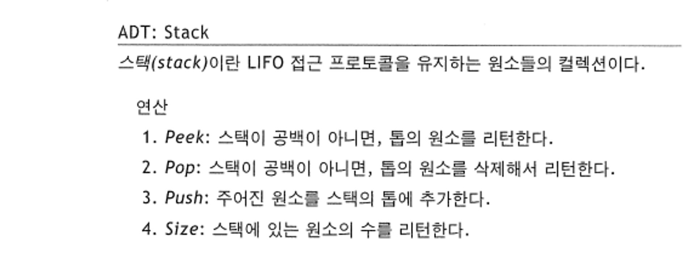
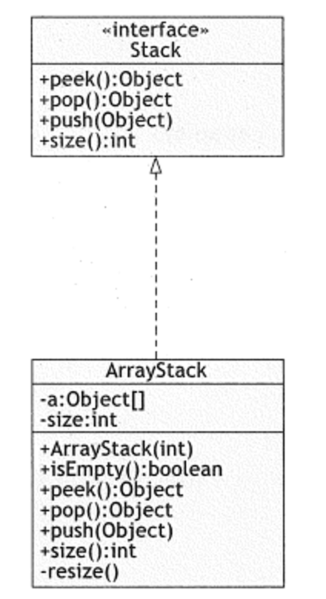

# 스택(Stack)

### 정의
- 스택(Stack)이란 후입선출(LIFO : last-in-first-out) 프로토콜을 구현하는 자료구조다. 
  - 후입 선출 : 마지막에 넣은 데이터가 가장 먼저 삭제되는 구조
- 즉, 이 구조에서 접근 가능한 유일한 객체는 가장 최근에 삽입된 객체다. 
- ADT(추상 데이터 타입) 으로서의 스택에 대한 정형적인 기술은 다음과 같다.
    
    
- 물건을 쌓는 것처럼 차곡차곡 쌓아 올린 형태의 자료구조를 의미한다.
- 같은 구조와 크기의 자료를 **정해진 방향으로만** 쌓을 수 있다.
- Stack Interface를 구현하는 가장 명확하고 단순한 방법은 배열을 사용하는 것이다. ArrayStack 구현은 스택의 원소를 저장하기 위해 지원 배열 a[ ]를 사용한다. 나머지 필드는 스택에 있는 원소의 수를 세기 위한 정수 필드 size이다.
- 이 인터페이스에 의해 요구되는 4개 메소드 (peek(), pop(), push(), size()) 외에 이 클래스는 public isEmpty() 메소드와 private resize() 메소드를 포함하고 있다. 
  - 후자는 배열이 가득 찾을 때 push()에 의해 호출된다. 이 메소드는 배열의 크기를 2배로 재구축한다.
- peek()과 pop() 메소드는 스택이 공백이 아닐 때만 사용 가능하며, pop() 메소드는 스택에서 제거되는 객체를 참조하는 배열 원소를 a[size] = null로 재설정한다. 이는 도달 불가능한 참조가 유지되는 것을 방지한다.
- Stack 인터페이스에 대한 ArrayStack 구현은 스택이 꽉 찼을 때 배열을 재구축해야 하므로 다소 비효율적이다. 
  - 배열은 원소를 인접한 메모리 위치에 유지하므로 동적으로 성장할 수 없다. 배열을 확장하려면 전체 배열을 재할당하고 복사해야 한다. 
  - 이 문제를 해결하려면 배열 대신에 연결 구조를 이용해 스택의 원소를 저장해야 한다.
> 비어있는 스택에서 원소를 추출하려고 할 때 **Stack Underflow**, 스택이 넘치는 경우 **Stack Overflow**라고 한다

### 특징

- 요소의 삽입과 삭제는 스택의 상단에서만 이루어지며, 최근에 삽입된 요소가 가장 먼저 삭제된다. 스택은 주로 함수 호출이나 임시 데이터 저장 등 다양한 상황에서 사용된다.
- 주로 배열 또는 연결리스트를 통해 구현하고, 웹브라우저의 페이지 뒤로가기, undo, 문자열 뒤집기와 같은 프로그램에 사용된다.
- Ctrl + Z 시 가장 최근에 수정한 내역이 되돌려진다.
- 동작(웹페이지 동작, ctrl+c/v) → 스택에 저장 Undo → ctrl+z  → request 전부 스택에 저장 → 마지막 명령 취소하고 그 전의 명령을 다시 실행한다.
- T(TOP Pointer) - 스택 포인터(SP)라고도 한다. Stack으로 할당된 기억공간에 가장 마지막으로 삽입된 자료가 기억된 공간을 가리키는 요소이다.

### Stack Method

- **pop()**: 스택에서 가장 위에 있는 항목을 제거한다.
- **push(item)**: item 하나를 스택의 가장 윗 부분에 추가한다.
- **peek()**: 스택의 가장 위에 있는 항목을 반환한다.
- **isEmpty():** 스택이 비어 있을 때에 true를 반환한다.
- **top()**: 최상단 요소 확인

### 구현
> 연결 구조를 이용한 스택 임의 구현체
```java
public class LinkedStack implements Stack{
	private Node top;
	private int size;
	
	public boolean isEmpty() {
		return (size == 0);
	}
	
	@Override
	public Object peek() {
		if(size == 0) throw new java.util.NoSuchElementException();
		return top.object;
	}
	
	@Override
	public Object pop() {
		if(size == 0) throw new java.util.NoSuchElementException();
		Object oldTop = top.object;
		top = top.next;
		--size;
		return oldTop;
	}
	@Override
	public void push(Object object) {
		top = new Node(object,top);
		++size;
	}

	@Override
	public int size() {
		return size;
	}
	
	private static class Node{
		Object object;
		Node next;
		Node(Object object, Node next){
			this.object = object;
			this.next = next;
		}
	}
	
}
```
> RPN 계산기 임의 구현체
```java
public class RPN {
    public RPN(String[] args) {
		Stack stack = new ArrayStack(args.length);
		for(int i = 0; i < args.length; i++) {
			String input = args[i];
			if(isAnOperator(input)) {
				double y = Double.parseDouble((String)stack.pop());
				double x = Double.parseDouble((String)stack.pop());
				double z = evaluate(x, y, input);
				stack.push(""+z);
			}
			else stack.push(input);
		}
	}
	
	private boolean isAnOperator(String s) {
		return (s.length() == 1 && "ASMD".indexOf(s) >= 0);
	}
	
	private double evaluate(double x, double y, String op) {
		double z = 0;
		if(op.endsWith("A")) 		z = x + y;
		else if(op.endsWith("S")) 	z = x - y;
		else if(op.endsWith("M")) 	z = x * y;
		else z = 					x / y;
		System.out.println(x + " " + op + " " + y + " " + z);
		return z;
	}
	
	public static void main(String[] args) {
		new RPN(args);
	}
}
```