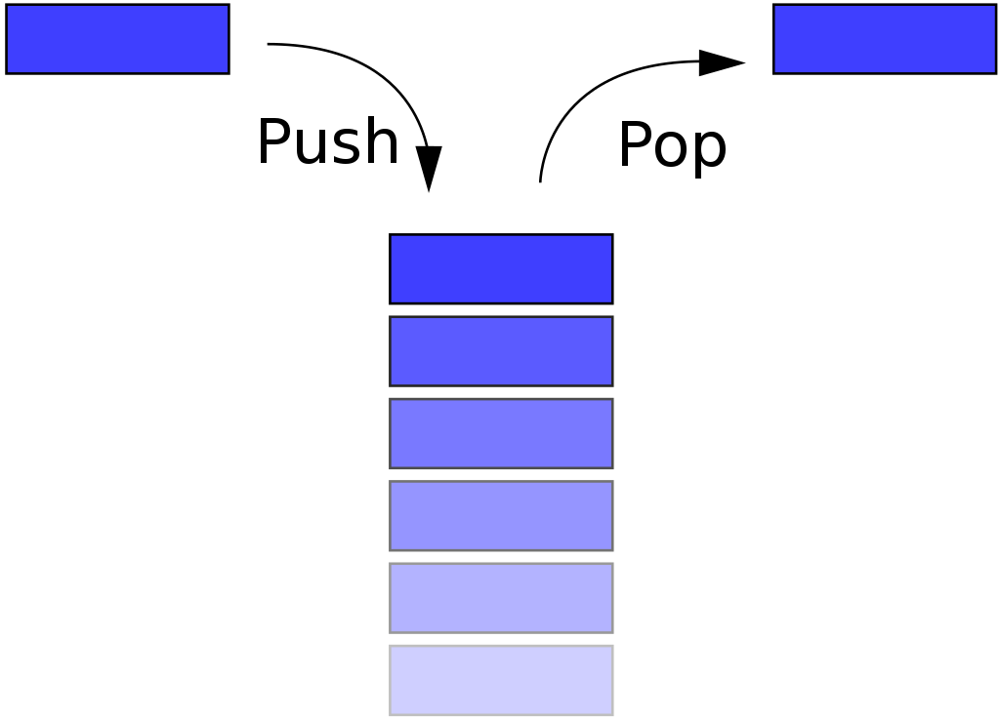

# 스택(Stack)

- 데이터를 쌓아올린 형태의 자료구조
- 가장 마지막에 삽입된 자료가 가장 먼저 삭제되는 구조(Last In First Out)
- 정해진 방향으로만 쌓을 수 있으며, top으로 정한 곳을 통해서만 접근할 수 있다.


### 스택의 특징

- 후입선출(LIFO)의 구조로 먼저 들어온 데이터가 나중에 빠져나가는 구조이다.
- 단방향 입출력 구조 : 데이터의 들어오는 방향과 나가는 방향이 같다.
- 데이터를 하나씩만 넣고 뺄 수 있다.
- 깊이 우선 탐색(DFS)에 이용된다.
    - 루트노드에서 시작해서 다음 분기로 넘어가기 전에 해당 분기를 완벽하게 탐색하는 방법
    - 모든 노드를 방문하고자 할 때 사용

### 자바에서의 스택

```java
import java.util.Stack;

class Stack {
    public static void main(String[] args) {
        // Integer형 스택 선언
        Stack<Integer> stackInt = new Stack<>();
        // String형 스택 선언
        Stack<String> stackStr = new Stack<>();
        // Boolean형 스택 선언
        Stack<Boolean> stackBool = new Stack<>();

				// 값 추가 push()
				// 데이터를 스택에 추가하고, 해당 값을 반환한다.
        stackInt.push(1);
        stackInt.push(2);
        stackInt.push(3);
        // 1, 2, 3 순으로 값 추가

				// 스택의 마지막 요소 반환
				// 스택이 비어있을 경우 NoSuchElementException 예외 발생
				// 3 출력
				System.out.println(stackInt.peek());

        // 값 제거
			  // 스택의 값이 제거됨과 동시에 해당 값을 반환한다.
        stackInt.pop();
        stackInt.pop();
        stackInt.pop();
        // 3, 2, 1 순으로 값 제거

        // 값 추가 add()
        stackInt.add(1);
        stackInt.add(2);
        stackInt.add(3);
        // 1, 2, 3 순으로 값 추가

				// 스택에서 검색하여 해당 위치 반환 search()
				// 해당하는 값이 여러개일 경우 마지막 위치 반환
				// 해당하는 값이 없을 경우 -1 반환
				// 3 출
				System.out.println(stackInt.search(2));

        // 값 모두 제거
				// 반환값이 없다.
        stackInt.clear();

				// 스택이 비어있는지 여부 확인
				// true 출력
				System.out.println(stackInt.isEmpty());
    }
}

``````